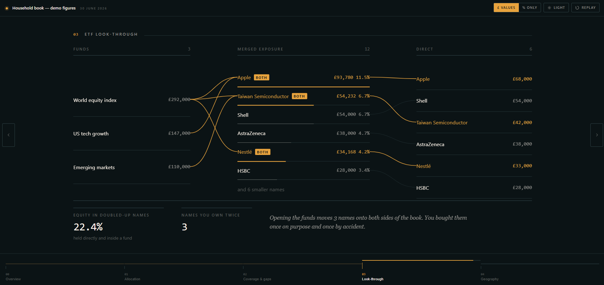
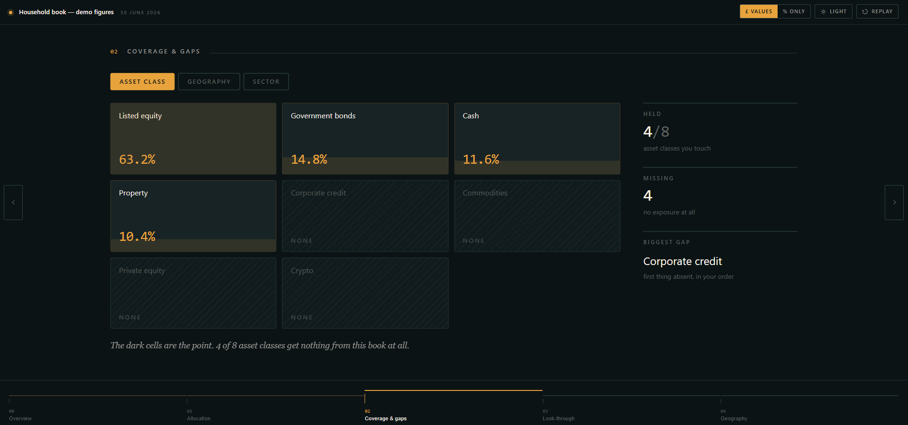
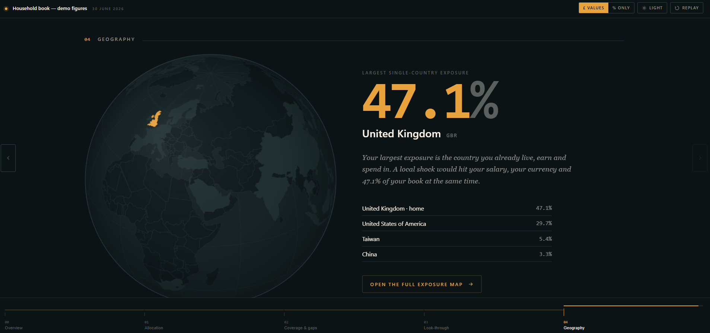

# Portfolio scene deck

A single HTML file that walks through one investment portfolio in five animated
screens, plus a standalone world exposure map. It opens your ETFs up to the companies
underneath, flags what you're doubled up on, and shows what you own none of.

No install, no build step, no signup, no network calls. Open the file in a browser and
your numbers stay on your machine.

**[Open the live demo →](https://YOUR-USERNAME.github.io/portfolio-scene-deck/)**
*(runs on made-up figures)*

## What it shows

| Screen | |
|---|---|
| **Overview** | Total value, gain, gain on cost, and the value in your local currency |
| **Allocation** | Donut by asset class, with liabilities shown outside the circle rather than as a slice |
| **Coverage & gaps** | A grid across asset class, geography and sector — the cells you own nothing in stay dark and say "none" |
| **ETF look-through** | Funds on one side, direct holdings on the other, merged in the middle. Names on both sides get flagged, with the percent of equity sitting in them |
| **Geography** | Rotating globe with your home country lit, plus your largest single-country exposure |
| **Exposure map** | A separate page: world choropleth shaded by exposure, with a ranked country list |

There's a light/dark toggle and a `$`/`%` toggle that hides every currency figure and
shows percentages only — useful if you want to show someone the shape of your portfolio
without the amounts.

## Using it with your own numbers

Download **[`portfolio-deck.html`](portfolio-deck.html)** — the blank template. Every
figure in it is a `[PLACEHOLDER]`.

**The easy way.** Hand the file, [`PROMPT.md`](PROMPT.md) and your holdings to any AI
assistant. The prompt tells it exactly what to fill in and, importantly, tells it not to
invent anything it wasn't given.

**By hand.** Open the file in any text editor. There's a `DATA` block at the top — it's
the only thing you need to touch. Everything below the `ENGINE` banner is machinery.

Anything you leave bracketed renders as a dash, and a card in the corner counts what's
still unfilled. It never guesses.

## What you'll need

- Total value, gain, gain on cost
- Your asset classes with values and weights, and any liabilities
- Your direct holdings: name, ticker, value, country (ISO3), sector
- For each ETF: its value, plus the top holdings and weights from the factsheet

The ETF weights are the only real work — maybe twenty minutes for three or four funds,
once. The look-through is only as good as what you put in.

## Notes

- Country outlines are Natural Earth 110m (177 countries), embedded in the file. A few
  small financial centres — Singapore, Hong Kong, Malta among them — aren't in that
  dataset, so exposure tagged there won't shade the map.
- Tickers must match between your direct holdings and your ETF constituents, or the
  overlap detection won't fire.
- Count-ups run on a wall clock, and `prefers-reduced-motion` is respected.
- Works down to phone width, though the look-through screen is happiest on a wide one.

Not financial advice. It arranges your own numbers; it doesn't tell you what to do
about them.

## Licence

MIT — do what you like with it.
